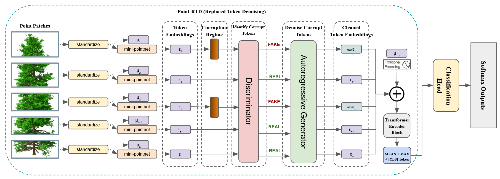

# PointRTD: Replaced Token Denoising for Robust Point Cloud Pretraining

This repository contains the implementation for the paper:

**PointRTD: Replaced Token Denoising for Robust Point Cloud Pretraining**  


## Installation

1. Clone this repository:
   ```bash
   git clone https://github.com/GunnerStone/PointRTD.git
   cd PointRTD
   ```

2. Installing Dependencies

`conda env create -f environment.yaml`

Below is a tested combination of library versions that are compatible. Start here if you are having trouble. 

#### Environment Details
- **Python**: 3.10.4
- **PyTorch**: 2.4.1 (`py3.10_cuda12.1_cudnn9.1.0_0` build)
- **PyTorch-CUDA**: 12.1
- **PyTorch3D**: 0.7.8 (`py310_cu121_pyt241` build)
- **Torch-Geometric**: 2.6.1
- **Torch-Cluster**: 1.6.3 (`+pt24cu121` build)
- **Torch-Scatter**: 2.1.2 (`+pt24cu121` build)
- **Torch-Sparse**: 0.6.18 (`+pt24cu121` build)
- **Torch-Spline-Conv**: 1.2.2 (`+pt24cu121` build)

#### Notes
- Make sure to install the exact versions listed above to avoid compatibility issues.
- These libraries are designed to work with CUDA 12.1 and cuDNN 9.1.0, so ensure your system supports these versions.
- All other libraries should be fairly easy to pip/conda install.


# Training

# Pretraining PointRTD on ShapeNetCore.v2

Download the ShapeNetCore.v2 using the instructions found in the [README](ShapeNetCore.v2/README.md)

# Run through the provided pretraining notebook:
`pretrain_pointRTD.ipynb` will produce pretraining checkpoints located in `./checkpoints/Pretrain_PointRTD/CR_XX/pointrtd_epoch_XX_CR_XX.pth`

Once you have a satisfactory checkpoint, create a folder `./checkpoints_pointrtd/` and place your checkpoint file within this folder.

# Fine-tuning on ModelNet10 or ModelNet40

Download [ModelNet10](ModelNet10/README.md) and [ModelNet40](ModelNet10/README.md) using instructions found in their respective READMEs.

# Use the provided training notebook:
`train_modelnet10_pointRTD.ipynb` or `train_modelnet40_pointRTD.ipynb`

Make sure these are using the correct path for your desired pretrained model checkpoint file.
